# Chapter 1 — Basic Mathematics

*Mathematics and Statistics for Machine Learning*

---

## 1. Introduction

Every machine learning model you will ever build is, underneath, a piece of arithmetic. A neural network with a billion parameters does nothing that a school student could not do by hand — it just does it a billion times, very fast.

This chapter builds the arithmetic and algebra that the rest of the book stands on. If you can already solve `2x + 3 = 11`, some of this will feel familiar. Read it anyway, slowly. The goal is not to teach you *how* to compute these things — it is to teach you *why* they work, because once you understand why logarithms turn multiplication into addition, the log-loss formula in Chapter 11 stops being a formula to memorise and becomes something obvious.

We assume nothing. No prior mathematics is required.

---

## 2. Learning Objectives

By the end of this chapter you will be able to:

| # | Objective |
|---|---|
| 1 | Work confidently with fractions, decimals, percentages, and ratios |
| 2 | Explain what an exponent means and derive the laws of exponents |
| 3 | Define a logarithm from first principles and derive its three main laws |
| 4 | Rearrange algebraic equations and solve linear equations and inequalities |
| 5 | Solve simultaneous equations by substitution and by elimination |
| 6 | Define absolute value and explain its role in error metrics |
| 7 | Recognise polynomials and factorise using the three standard identities |
| 8 | Define a function, and read and interpret its graph |
| 9 | Derive the equation of a straight line and interpret slope and intercept |
| 10 | Read, write, and expand summation (Σ) and product (Π) notation |
| 11 | Use set notation, factorials, permutations, and combinations |
| 12 | Compute Euclidean and Manhattan distance and the midpoint between two points |
| 13 | Recognise where each of these appears inside a machine learning algorithm |

---

## 3. Real-world Motivation

Consider a concrete problem. You work at a bank and you want to predict whether a loan applicant will default.

You have three pieces of information about each applicant: annual income, age, and number of previous defaults. A simple model would give each piece of information a weight and add them up:

```
score = w₁ × income + w₂ × age + w₃ × previous_defaults + b
```

That single line contains almost this entire chapter:

- **Multiplication and addition** — the arithmetic itself
- **Variables** (`w₁`, `b`) — algebra
- **Summation notation** — because with 500 features you cannot write 500 terms by hand
- **A function** — score is a function of the inputs
- **A straight line** — with one feature, this equation *is* a line, and `w₁` is its slope
- **Logarithms** — because the raw score gets converted into a probability using a formula built from exponentials and logs
- **Scaling and ratios** — because income is measured in hundreds of thousands and age in tens, and the model will be dominated by income unless we fix that

Nothing here is advanced. But every one of these ideas must be solid, or the models built on top of them will be built on sand.

> **Why this matters more than it looks**
> The most common cause of a broken machine learning model is not a misunderstanding of deep learning. It is a units error, a scaling error, or a misread formula — a basic-mathematics mistake wearing a sophisticated costume.

---

## 4. Numbers: The Foundation

### 4.1 Why numbers exist

Counting came first. A shepherd with forty sheep needed to know whether forty came back. Setting one pebble aside per sheep solves the problem without any concept of "forty" at all — this is a **one-to-one correspondence**, and it is the true origin of number.

From that need, number systems grew outward, each one invented because the previous one could not answer some question.

### 4.2 The number systems

| Symbol | Name | Contains | Invented to solve |
|---|---|---|---|
| ℕ | Natural numbers | 1, 2, 3, 4, … | Counting objects |
| 𝕎 | Whole numbers | 0, 1, 2, 3, … | Representing "none" |
| ℤ | Integers | …, −2, −1, 0, 1, 2, … | Debt, subtraction such as 3 − 5 |
| ℚ | Rational numbers | Any p/q where p, q ∈ ℤ and q ≠ 0 | Division, sharing, parts of a whole |
| ℝ | Real numbers | All rationals plus irrationals (√2, π, e) | Measuring continuous quantities |

Each system was created because the one before it hit a wall.

**The wall that created integers.** Natural numbers cannot answer `3 − 5`. Once you accept debt as a real thing, you need negative numbers.

**The wall that created rationals.** Integers cannot answer `3 ÷ 5`. Once you need to share three loaves among five people, you need fractions.

**The wall that created reals.** Here is the beautiful one. The Pythagoreans believed every number was a ratio of whole numbers. Then someone asked: what is the length of the diagonal of a square whose sides are 1?

By Pythagoras, that length `d` satisfies `d² = 1² + 1² = 2`, so `d = √2`.

Now, the proof that √2 is *not* a fraction — this is worth walking through, because it is one of the oldest proofs in mathematics and it shows you what a proof feels like.

> **Derivation: √2 is irrational**
>
> Suppose, for contradiction, that √2 *is* rational. Then we can write it as a fraction in lowest terms:
>
> √2 = p/q,  where p and q share no common factor
>
> Square both sides:  2 = p²/q²
>
> Multiply both sides by q²:  2q² = p²
>
> The left side is 2 × something, so **p² is even**. If p² is even then p must be even (an odd number squared is always odd). So write p = 2k for some integer k.
>
> Substitute:  2q² = (2k)² = 4k²
>
> Divide both sides by 2:  q² = 2k²
>
> By the same argument, **q² is even, so q is even**.
>
> But we now have both p and q even — they share the common factor 2. That contradicts our starting assumption that the fraction was in lowest terms. The assumption must be false.
>
> **Therefore √2 cannot be written as a fraction.** ∎

That single proof forced mathematics to accept a new kind of number. In machine learning you will meet irrationals constantly: `e` sits inside the sigmoid function, `π` sits inside the normal distribution.

### 4.3 Where this appears in ML

| Number type | Where you meet it |
|---|---|
| Integers | Class labels (0/1), counts, array indices, sample sizes |
| Rationals | Probabilities, ratios, learning rates |
| Reals | Feature values, model weights, loss values |

---

## 5. Fractions, Decimals, Percentages, and Ratios

These four are the same idea in four costumes. Confusing them is a leading cause of embarrassing errors in model reporting.

### 5.1 Fractions

A fraction `p/q` means: divide a whole into `q` equal parts and take `p` of them.

- `p` is the **numerator** — how many parts you take
- `q` is the **denominator** — how many parts the whole was cut into

**Why the rules work.**

*Addition needs a common denominator.* You cannot add 1/2 and 1/3 directly because the pieces are different sizes — it is like adding one slice of a cake cut in two to one slice of a cake cut in three. You must first re-cut both into the same size:

```
1/2 = 3/6      1/3 = 2/6      →      3/6 + 2/6 = 5/6
```

*Multiplication needs no common denominator.* `(1/2) × (1/3)` asks: take one third **of** one half. Cut a half into three parts and take one — you get one sixth. So we multiply tops and bottoms:

```
p/q × r/s = (p×r)/(q×s)
```

*Division flips the second fraction.* `(1/2) ÷ (1/4)` asks: how many quarters fit into a half? Two. And indeed `(1/2) × (4/1) = 4/2 = 2`. Dividing by a number is the same as multiplying by its reciprocal, because that is what "reciprocal" means — the number that undoes it.

### 5.2 Decimals

A decimal is a fraction whose denominator is a power of 10, written positionally:

```
0.375 = 3/10 + 7/100 + 5/1000 = 375/1000 = 3/8
```

### 5.3 Percentages

"Per cent" is Latin for "per hundred". A percentage is a fraction with denominator fixed at 100:

```
37.5% = 37.5/100 = 0.375
```

**To convert:** fraction → decimal, divide. Decimal → percentage, multiply by 100.

> **The percentage trap that ruins model reports**
> If accuracy rises from 90% to 95%, is that a 5% improvement or a 5.6% improvement?
>
> - **5 percentage points** — the absolute difference: 95 − 90 = 5
> - **5.6 percent** — the relative change: (95 − 90)/90 = 0.0556 = 5.6%
>
> These are different numbers and both are correct. Say "percentage points" when you mean the absolute gap. Vendors who want to look good quote whichever is larger.

### 5.4 Ratios and proportions

A **ratio** compares two quantities: `a : b`. A **proportion** states that two ratios are equal: `a/b = c/d`.

From a proportion you get **cross-multiplication**, and it is worth seeing why rather than memorising it:

> **Derivation: cross-multiplication**
>
> Start with:  a/b = c/d
>
> Multiply both sides by b:  a = (c/d) × b
>
> Multiply both sides by d:  a × d = c × b
>
> So **ad = bc**. It is just multiplying both sides by both denominators. ∎

**In ML:** class imbalance is a ratio. If a fraud dataset has 950 legitimate and 50 fraudulent transactions, the ratio is 19:1. That single number tells you immediately that a model predicting "legitimate" every time scores 95% accuracy while being completely useless — the reason Chapter 11 spends so long on precision and recall.

---

## 6. Exponents and Roots

### 6.1 What an exponent means

An exponent is repeated multiplication, exactly as multiplication is repeated addition.

```
a^n = a × a × a × … × a     (n times)
```

Here `a` is the **base** and `n` is the **exponent** or **power**.

### 6.2 Deriving the laws of exponents

Do not memorise these. Derive them once and you will never forget them.

**Product rule: aᵐ × aⁿ = aᵐ⁺ⁿ**

> Write both out in full:
> ```
> aᵐ × aⁿ = (a×a×…×a) × (a×a×…×a)
>              m times      n times
> ```
> Altogether that is `a` multiplied by itself `m + n` times. So the result is `aᵐ⁺ⁿ`. ∎

**Quotient rule: aᵐ ÷ aⁿ = aᵐ⁻ⁿ**

> ```
> a⁵/a² = (a×a×a×a×a)/(a×a)
> ```
> Two `a`s cancel top and bottom, leaving three: `a³ = a⁵⁻²`. ∎

**Power rule: (aᵐ)ⁿ = aᵐⁿ**

> `(a³)²` means `a³ × a³`, which by the product rule is `a³⁺³ = a⁶ = a³ˣ²`. ∎

**Zero exponent: a⁰ = 1**

This one confuses everybody, so here is why it *must* be 1:

> By the quotient rule, `aⁿ/aⁿ = aⁿ⁻ⁿ = a⁰`.
>
> But anything divided by itself is 1. So `a⁰ = 1`.
>
> It is not an arbitrary convention — it is forced on us by the quotient rule. (Note `a ≠ 0`; `0⁰` is left undefined.) ∎

**Negative exponent: a⁻ⁿ = 1/aⁿ**

> By the quotient rule, `a²/a⁵ = a²⁻⁵ = a⁻³`.
>
> But writing it out: `(a×a)/(a×a×a×a×a) = 1/a³`.
>
> So `a⁻³ = 1/a³`. A negative exponent means reciprocal. ∎

**Fractional exponent: a^(1/n) = ⁿ√a**

> By the power rule, `(a^(1/2))² = a^(1/2 × 2) = a¹ = a`.
>
> So `a^(1/2)` is the number which, squared, gives `a` — that is precisely the definition of √a. ∎

### 6.3 Summary of exponent laws

| Law | Formula | Example |
|---|---|---|
| Product | aᵐ · aⁿ = aᵐ⁺ⁿ | 2³ · 2⁴ = 2⁷ = 128 |
| Quotient | aᵐ / aⁿ = aᵐ⁻ⁿ | 2⁵ / 2² = 2³ = 8 |
| Power of power | (aᵐ)ⁿ = aᵐⁿ | (2³)² = 2⁶ = 64 |
| Power of product | (ab)ⁿ = aⁿbⁿ | (2·3)² = 4·9 = 36 |
| Power of quotient | (a/b)ⁿ = aⁿ/bⁿ | (4/2)³ = 64/8 = 8 |
| Zero | a⁰ = 1 (a ≠ 0) | 7⁰ = 1 |
| Negative | a⁻ⁿ = 1/aⁿ | 2⁻³ = 1/8 |
| Fractional | a^(m/n) = ⁿ√(aᵐ) | 8^(2/3) = 4 |

### 6.4 The number e

One irrational number deserves its own section because it appears everywhere in machine learning.

`e ≈ 2.71828…`

It arises from a question about compound interest. Invest ₹1 at 100% annual interest. Compounded once a year you finish with ₹2. Compounded twice a year, each half earns 50%: `(1 + 1/2)² = 2.25`. Compounded monthly: `(1 + 1/12)¹² ≈ 2.613`. Daily: ≈ 2.7146.

As the compounding gets infinitely frequent, the value settles on a specific number:

```
e = lim (1 + 1/n)ⁿ  as n → ∞  ≈ 2.718281828…
```

**Why ML cares:** the function `eˣ` is the only function that is its own derivative. That property makes it the natural choice wherever calculus meets probability — which is why it sits inside the sigmoid function, the softmax function, the normal distribution, and the Poisson distribution you saw on the Module 4 sheet.

---

## 7. Logarithms

### 7.1 The problem logarithms solve

Before calculators, astronomers had to multiply enormous numbers by hand — a slow, error-prone job. In 1614 John Napier published a method that converted every multiplication into an addition. It is said to have doubled the working life of an astronomer.

### 7.2 Definition from first principles

A logarithm answers a single question:

> **"What power do I raise the base to, in order to get this number?"**

Formally:

```
log_b(x) = y     if and only if     b^y = x
```

The two statements are the same fact written in two directions. `log` is simply the inverse of exponentiation, the way subtraction is the inverse of addition.

| Exponential form | Logarithmic form | Read as |
|---|---|---|
| 2³ = 8 | log₂(8) = 3 | "2 to what power gives 8? Three." |
| 10² = 100 | log₁₀(100) = 2 | "10 to what power gives 100? Two." |
| e¹ = e | ln(e) = 1 | "e to what power gives e? One." |

**Common bases:**
- `log₁₀` — the **common logarithm**, often written just `log`
- `logₑ` — the **natural logarithm**, written `ln`; this is the default in machine learning
- `log₂` — the **binary logarithm**, used in information theory and decision trees

### 7.3 Deriving the laws of logarithms

Every log law is an exponent law in disguise. Here is the proof pattern.

**Product law: log_b(MN) = log_b(M) + log_b(N)**

> Let `log_b(M) = x` and `log_b(N) = y`.
>
> By definition:  `M = bˣ` and `N = b^y`
>
> Multiply:  `MN = bˣ × b^y = b^(x+y)`  ← *by the product rule for exponents*
>
> Convert back to log form:  `log_b(MN) = x + y`
>
> Substitute back:  **log_b(MN) = log_b(M) + log_b(N)** ∎

This is Napier's trick. Multiplication became addition.

**Quotient law: log_b(M/N) = log_b(M) − log_b(N)**

> Same setup: `M = bˣ`, `N = b^y`.
>
> Divide:  `M/N = bˣ/b^y = b^(x−y)`
>
> Convert back:  **log_b(M/N) = x − y = log_b(M) − log_b(N)** ∎

**Power law: log_b(Mᵏ) = k · log_b(M)**

> Let `log_b(M) = x`, so `M = bˣ`.
>
> Raise both sides to the power k:  `Mᵏ = (bˣ)ᵏ = b^(kx)`
>
> Convert back:  **log_b(Mᵏ) = kx = k · log_b(M)** ∎

**Change of base: log_b(x) = log_c(x) / log_c(b)**

> Let `log_b(x) = y`, so `bʸ = x`.
>
> Take log base c of both sides:  `log_c(bʸ) = log_c(x)`
>
> By the power law:  `y · log_c(b) = log_c(x)`
>
> Divide:  **y = log_c(x) / log_c(b)** ∎
>
> This is how a calculator with only `log₁₀` and `ln` computes `log₂(8)`: as `ln(8)/ln(2) = 2.079/0.693 = 3`.

### 7.4 Key values and rules

| Rule | Reason |
|---|---|
| log_b(1) = 0 | b⁰ = 1 |
| log_b(b) = 1 | b¹ = b |
| log_b(bˣ) = x | log and exp are inverses |
| b^(log_b x) = x | same, other direction |
| log(x) undefined for x ≤ 0 | no power of a positive base gives 0 or a negative number |

That last row matters practically. Applying `log` to a column containing zeros crashes or produces `−∞`. The standard fix is `log1p(x) = log(1 + x)`, which is well behaved at x = 0.

### 7.5 Why machine learning is soaked in logarithms

**Reason 1 — Products become sums.** Probability models multiply many small probabilities together. With 1,000 data points, each of probability ~0.01, the product is 10⁻²⁰⁰⁰ — which a computer stores as exactly zero. This is **numerical underflow**, and it would silently destroy the model. Taking logs converts the product into a sum of 1,000 manageable numbers. Every implementation of Naive Bayes and every neural network loss function does this.

```
log(p₁ × p₂ × … × pₙ) = log(p₁) + log(p₂) + … + log(pₙ)
```

**Reason 2 — Skew becomes symmetry.** Income, city population, and website visits all have long right tails. Taking logs compresses the large values and pulls the distribution towards symmetry, which many models assume. This is the log transformation on your Module 10 sheet.

**Reason 3 — Multiplicative becomes additive.** Log turns "10× larger" into "a constant step", which is often the more meaningful scale. The difference between ₹10,000 and ₹20,000 of income matters far more to a person than the difference between ₹10,00,000 and ₹10,10,000, even though the second gap is larger in rupees.

> **Tip**
> Whenever you see `log` in a machine learning formula, ask which of these three jobs it is doing. It is almost always one of them.

---

## 8. Algebra: Working with Unknowns

### 8.1 Why algebra exists

Arithmetic answers "what is 3 + 5?". Algebra answers "3 plus *what* gives 8?". The moment you use a symbol to stand for an unknown quantity, you can describe relationships that hold for *every* number, not just one.

Machine learning is entirely built on this. A model is a relationship written with unknown symbols (`w₁`, `w₂`, `b`), and training is the process of finding the values of those unknowns that fit the data best.

### 8.2 Vocabulary

For the expression `3x² + 5x − 7`:

| Term | Meaning | Here |
|---|---|---|
| Variable | Symbol for an unknown or changing value | x |
| Coefficient | Number multiplying a variable | 3, 5 |
| Constant | Number standing alone | −7 |
| Term | A piece separated by + or − | 3x², 5x, −7 |
| Expression | Terms combined; no equals sign | 3x² + 5x − 7 |
| Equation | Two expressions set equal | 3x² + 5x − 7 = 0 |

### 8.3 Order of operations

When an expression has several operations, they are evaluated in a fixed order — **BODMAS** / **PEMDAS**:

1. **B**rackets / **P**arentheses
2. **O**rders / **E**xponents
3. **D**ivision and **M**ultiplication — left to right
4. **A**ddition and **S**ubtraction — left to right

```
2 + 3 × 4²  =  2 + 3 × 16  =  2 + 48  =  50        ✓
2 + 3 × 4²  =  (2 + 3) × 16 = 80                    ✗
```

Division and multiplication have *equal* priority and are done left to right, which is why `8 ÷ 2 × 4 = 16`, not 1.

### 8.4 The one rule of solving equations

> **Whatever you do to one side, do to the other.**

An equation is a balance scale. Anything that keeps both pans equal is legal.

**Worked example.** Solve `3x + 7 = 22`.

```
3x + 7 = 22
3x + 7 − 7 = 22 − 7      subtract 7 from both sides
3x = 15
3x / 3 = 15 / 3          divide both sides by 3
x = 5
```

**Check:** 3(5) + 7 = 15 + 7 = 22 ✓

Always check. It costs five seconds and catches most errors.

### 8.5 Rearranging formulas

This skill matters more than solving, because in ML you constantly need to isolate a different variable than the one a formula was written for.

**Example.** The standardisation (Z-score) formula from Module 10 is:

```
z = (x − μ) / σ
```

Suppose you have a standardised value and want the original. Make `x` the subject:

```
z = (x − μ) / σ
z × σ = x − μ              multiply both sides by σ
zσ + μ = x                 add μ to both sides
x = zσ + μ
```

This is exactly what `scaler.inverse_transform()` does in scikit-learn.

### 8.6 Inequalities

An inequality uses `<`, `>`, `≤`, or `≥` instead of `=`. All the rules of equations apply, with **one critical exception**:

> **Multiplying or dividing both sides by a negative number reverses the inequality sign.**

Why? Consider `2 < 5`, which is true. Multiply both sides by −1: is `−2 < −5`? No — −2 is to the right of −5 on the number line. The correct statement is `−2 > −5`. Multiplying by a negative reflects the number line, which swaps left and right.

```
−2x > 8
x < −4          divide by −2, flip the sign
```

**In ML:** inequalities define classification decision rules (`if score > 0.5, predict positive`), constraints in optimisation, and the bounds in confidence intervals.

### 8.7 Inequalities in two variables

An inequality in two variables such as `x + y − 2 > 0` is not satisfied by a single point but by an entire **region** of the plane.

To find it, first rearrange into the familiar line form:

```
x + y − 2 > 0
y > −x + 2
```

Now draw the boundary line `y = −x + 2`. The solution is every point **above** that line, because those are the points whose y-value exceeds `−x + 2`.

| Sign | Boundary line | Region |
|---|---|---|
| `>` or `<` | Dashed — not included | Strictly above / below |
| `≥` or `≤` | Solid — included | Above / below, boundary included |

**Why this matters:** this is exactly what a linear classifier does. A logistic regression or linear SVM learns a boundary line (or hyperplane), and then classifies each point by which side of it the point falls on:

```
predict class 1  if  w₁x₁ + w₂x₂ + b > 0
predict class 0  otherwise
```

The decision boundary is the line. The two classes are the two regions. Everything a linear classifier does is contained in this one picture.

### 8.8 Simultaneous equations

Two equations, two unknowns. A single linear equation in two variables has infinitely many solutions — it describes a whole line. Add a second equation and, in general, exactly one point satisfies both: the point where the two lines cross.

```
x + y = 5      … (1)
2x − y = 1     … (2)
```

**Method 1 — Elimination.** Add or subtract the equations so that one variable cancels.

```
(1) + (2):   (x + y) + (2x − y) = 5 + 1
             3x = 6
             x = 2

Substitute into (1):  2 + y = 5  →  y = 3
```

**Solution: (2, 3).** Check in (2): `2(2) − 3 = 1` ✓

**Method 2 — Substitution.** Make one variable the subject, then substitute.

```
From (1):  y = 5 − x
Into (2):  2x − (5 − x) = 1
           3x − 5 = 1
           x = 2,  then y = 3
```

Same answer, as it must be.

**The three possible outcomes.** This is the important conceptual point, and it returns in Module 12:

| Case | Geometry | Solutions |
|---|---|---|
| Lines cross once | Different slopes | Exactly one |
| Lines are parallel | Same slope, different intercept | None — inconsistent |
| Lines are identical | Same slope and intercept | Infinitely many |

> **Where this goes**
> Written in matrix form, a system of simultaneous equations becomes `Ax = b` — the central object of Module 12. The "no solution" and "infinitely many solutions" cases correspond exactly to a determinant of zero, which is why your Linear Algebra sheet flags `|A| = 0` as the singular, non-invertible case.
>
> Linear regression solves such a system. The **normal equation** `w = (XᵀX)⁻¹Xᵀy` is simultaneous equations at scale — one equation per parameter, solved all at once.

### 8.9 Absolute value

The absolute value of a number is its distance from zero, ignoring direction.

```
|x| = {  x,   if x ≥ 0
      { −x,   if x < 0
```

```
|5| = 5        |−3| = 3        |0| = 0
```

The second line of the definition confuses people. `−x` when x is negative gives a *positive* result: if `x = −3`, then `−x = −(−3) = 3`. The minus sign is not making it negative — it is undoing the negativity.

**Properties:**

| Property | Statement |
|---|---|
| Non-negative | \|x\| ≥ 0 always |
| Multiplicative | \|ab\| = \|a\|·\|b\| |
| Triangle inequality | \|a + b\| ≤ \|a\| + \|b\| |
| Relation to squares | \|x\| = √(x²) |

**The graph** is a V with its vertex at the origin — two straight lines, `y = x` for x ≥ 0 and `y = −x` for x < 0, meeting at a sharp corner.

> **Why the corner matters in ML**
> That vertex is a point where the function is not differentiable — there is no single tangent line at a sharp corner. This is not a footnote. It is the reason **Mean Absolute Error** is harder to optimise with gradient descent than Mean Squared Error, and the reason **L1 (Lasso) regularisation** drives coefficients to exactly zero while L2 (Ridge) only shrinks them towards zero. The entire difference between Lasso and Ridge traces back to the shape of this corner.

**In ML:** absolute value appears in MAE, MAPE, and L1 regularisation on your Module 11 and Module 10 sheets, and in the Manhattan distance formula in Section 13.

### 8.10 Polynomials

A **polynomial** is a sum of terms, each a coefficient multiplied by a whole-number power of the variable.

```
P(x) = aₙxⁿ + aₙ₋₁xⁿ⁻¹ + … + a₁x + a₀
```

The **degree** is the highest power present.

| Polynomial | Degree | Name |
|---|---|---|
| 7 | 0 | Constant |
| 2x + 1 | 1 | Linear |
| x² − 3x + 2 | 2 | Quadratic |
| 3x³ − 2x² + 5x − 7 | 3 | Cubic |

Note what is *not* allowed: negative powers (`x⁻¹`), fractional powers (`√x`), and variables in the exponent (`2ˣ`). Those are perfectly good functions, but they are not polynomials.

**In ML:** polynomial features are the standard way to let a linear model capture curvature. Given a single feature `x`, generating `x²` and `x³` as extra columns lets linear regression fit a curve while remaining linear *in its parameters* — which is the trick that keeps the mathematics tractable. This is section F.1 of your Module 10 sheet.

> **Warning**
> Degree is a trap. A degree-15 polynomial can pass exactly through every training point and be worthless on new data. This is the classic picture of overfitting, and it is why polynomial degree is a hyperparameter to tune rather than to maximise.

### 8.11 Factorisation

Factorising means writing an expression as a product. It is the reverse of expanding, and it is how you find where an expression equals zero — because a product is zero exactly when one of its factors is zero.

**The three identities worth knowing by heart:**

**1. Common factor**
```
ax + ay = a(x + y)
```
Just the distributive law read backwards.

**2. Difference of squares**
```
a² − b² = (a − b)(a + b)
```
> **Derivation.** Expand the right side:
> ```
> (a − b)(a + b) = a² + ab − ab − b² = a² − b²
> ```
> The two middle terms cancel exactly. ∎

**3. Perfect squares**
```
(a + b)² = a² + 2ab + b²
(a − b)² = a² − 2ab + b²
```
> **Derivation.** `(a + b)² = (a + b)(a + b) = a² + ab + ba + b² = a² + 2ab + b²`.
>
> The `2ab` term is the one everyone forgets. It exists because there are *two* cross-products, `ab` and `ba`. ∎

**Factorising a quadratic.** To factorise `x² − 5x + 6`, look for two numbers that multiply to give the constant (6) and add to give the middle coefficient (−5). Those are −2 and −3:

```
x² − 5x + 6 = (x − 2)(x − 3)
```

So the expression is zero when `x = 2` or `x = 3`.

> **Why ML cares about the perfect-square identity**
> It is not decoration. Expanding the variance formula from Module 3 uses it directly:
> ```
> Var(X) = E[(X − μ)²] = E[X² − 2μX + μ²] = E[X²] − μ²
> ```
> That expansion — which turns a formula requiring two passes over the data into one requiring a single pass — is the perfect-square identity applied inside an expectation. The same algebra sits behind the bias-variance decomposition, where `E[(ŷ − y)²]` is expanded into a bias term, a variance term, and irreducible noise.

---

## 9. Functions

### 9.1 First principles

A **function** is a rule that takes an input and returns exactly one output.

```
f(x) = 2x + 3
```

Read as "f of x equals 2x plus 3". Feed in 4, get back 11.

The critical word is **exactly one**. A rule that returned two different outputs for the same input would not be a function — it would be unusable for prediction, because you would not know which answer to take.

| Term | Meaning |
|---|---|
| Domain | The set of allowed inputs |
| Range | The set of possible outputs |
| Independent variable | The input, usually x |
| Dependent variable | The output, usually y |

**Domain restrictions matter.** `f(x) = 1/x` has domain "all reals except 0". `f(x) = log(x)` has domain "x > 0". `f(x) = √x` has domain "x ≥ 0" for real outputs. Every one of these has caused a production ML pipeline to crash on a Monday morning.

### 9.2 A machine learning model *is* a function

This is the single most important sentence in the chapter.

```
prediction = f(features)
```

Linear regression, a random forest, and a neural network differ only in what `f` looks like inside. Training a model means searching for the best `f` from a family of candidates.

### 9.3 The function families you need

**Linear:  f(x) = mx + c**
A straight line. Constant rate of change. The basis of linear regression.

**Quadratic:  f(x) = ax² + bx + c**
A parabola. Opens upward if a > 0 (has a minimum), downward if a < 0 (has a maximum). Mean squared error is a quadratic function of the model's error, which is why it has a single lowest point that optimisation can find.

**Exponential:  f(x) = aˣ**
Grows by a constant *factor* per step. Always positive. Models compound growth, population, and — inverted — the decay of a learning rate over training.

**Logarithmic:  f(x) = log(x)**
The mirror image of exponential, reflected across the line y = x. Grows fast at first, then flattens dramatically. Compresses large values.

**Piecewise:  f(x) = x if x > 0, else 0**
This is **ReLU**, the most-used activation function in deep learning. Defined by different rules on different intervals.

### 9.4 Composite functions

Applying one function to the output of another:

```
(f ∘ g)(x) = f(g(x))
```

If `g(x) = x + 1` and `f(x) = x²`, then `f(g(3)) = f(4) = 16`.

**Why this matters enormously:** a neural network is nothing but a deep composition of simple functions.

```
output = f₄(f₃(f₂(f₁(input))))
```

Each layer is one function. Training such a network requires differentiating a composition — which is the chain rule on your Module 13 sheet. Composition is the reason the chain rule is the single most important formula in deep learning.

### 9.5 Inverse functions

An inverse function undoes the original: if `f(a) = b` then `f⁻¹(b) = a`.

`exp` and `log` are inverses. Squaring and square-rooting are inverses (on non-negative numbers). Standardisation and its inverse transform are inverses.

> **Warning**
> `f⁻¹(x)` means the *inverse function*, not `1/f(x)`. The notation is unfortunate and genuinely confusing. Context tells you which is meant.

---

## 10. Coordinate Geometry and the Straight Line

### 10.1 The idea

Descartes' insight was that every point on a plane can be labelled by a pair of numbers `(x, y)` — its horizontal and vertical distance from a fixed origin. This welded algebra to geometry: from that moment, every equation had a picture and every picture had an equation.

Machine learning lives on this idea. A dataset with two features *is* a set of points on a plane. A model with two features *is* a line or curve drawn through them.

### 10.2 Slope, derived

**Slope** measures steepness: how much y changes per unit change in x.

Given two points `(x₁, y₁)` and `(x₂, y₂)`:

```
        rise      y₂ − y₁
m  =  ——————  =  —————————
        run       x₂ − x₁
```

**Interpretation:**

| Slope | Meaning |
|---|---|
| m > 0 | Line rises left to right; y increases with x |
| m < 0 | Line falls; y decreases with x |
| m = 0 | Horizontal line; x has no effect on y |
| m undefined | Vertical line (x₂ = x₁, division by zero) |

### 10.3 The midpoint

The point exactly halfway between `(x₁, y₁)` and `(x₂, y₂)`:

```
M = ( (x₁ + x₂)/2 ,  (y₁ + y₂)/2 )
```

**Why:** the midpoint's x-coordinate is the average of the two x-coordinates, and likewise for y. Halfway along each axis is halfway along the line. That is all the formula says — it is the mean, applied one coordinate at a time.

**Example.** Midpoint of (1, 4) and (7, 10):
```
M = ((1+7)/2, (4+10)/2) = (4, 7)
```

**In ML:** generalised to n dimensions, this is the **centroid** — and computing centroids is the entire update step of k-means clustering. Each iteration assigns points to the nearest centre, then moves each centre to the midpoint (mean position) of the points assigned to it:

```
centroid = ( (1/k)Σxᵢ , (1/k)Σyᵢ , … )
```

Summation notation, the mean, and the midpoint formula are the same idea at three levels of generality.

### 10.4 Deriving the equation of a line

> **Derivation: slope-intercept form**
>
> Let the line have slope `m` and pass through the point `(0, c)` — that is, it crosses the y-axis at height c.
>
> Take any other point `(x, y)` on the line. The slope between these two points must equal m:
>
> ```
> (y − c) / (x − 0) = m
> ```
>
> Multiply both sides by x:
>
> ```
> y − c = mx
> ```
>
> Add c to both sides:
>
> ```
> y = mx + c
> ```
> ∎

**Every symbol:**

| Symbol | Name | Meaning |
|---|---|---|
| y | Dependent variable | The output being predicted |
| m | Slope | Change in y per one-unit change in x |
| x | Independent variable | The input feature |
| c | y-intercept | Value of y when x = 0 |

### 10.5 The connection to regression

Compare the two:

```
School:      y  =  m·x  +  c
Regression:  ŷ  =  b·x  +  a
```

They are the same equation. On your Module 9 sheet, `b` is the slope and `a` is the intercept. Simple linear regression is nothing more than the search for the values of `m` and `c` that place the line as close as possible to all the data points at once.

With many features, the same equation extends:

```
ŷ = w₁x₁ + w₂x₂ + … + wₙxₙ + b
```

Each `wᵢ` is a slope in its own direction. The picture becomes a plane, then a hyperplane, but the algebra never changes.

---

## 11. Summation and Product Notation

### 11.1 Why it exists

You cannot write out a sum of 10,000 terms. Σ notation is a compression scheme.

```
     n
    ———
    \
     |   xᵢ    =    x₁ + x₂ + x₃ + … + xₙ
    /
    ———
    i=1
```

Written inline: `Σᵢ₌₁ⁿ xᵢ`

**Reading it, piece by piece:**

| Part | Name | Meaning |
|---|---|---|
| Σ | Sigma | "Add up everything that follows" |
| i | Index | The counter |
| i = 1 | Lower limit | Where the counter starts |
| n | Upper limit | Where the counter stops |
| xᵢ | Summand | The thing being added, at each step |

### 11.2 Expanding it

```
Σᵢ₌₁⁴ i²  =  1² + 2² + 3² + 4²  =  1 + 4 + 9 + 16  =  30
```

```
Σᵢ₌₁³ 2i  =  2(1) + 2(2) + 2(3)  =  2 + 4 + 6  =  12
```

### 11.3 The properties, and why they hold

**Constant multiple:  Σ(c·xᵢ) = c·Σxᵢ**
> `2x₁ + 2x₂ + 2x₃ = 2(x₁ + x₂ + x₃)`. It is factoring. ∎

**Sum splits:  Σ(xᵢ + yᵢ) = Σxᵢ + Σyᵢ**
> `(x₁+y₁) + (x₂+y₂) = (x₁+x₂) + (y₁+y₂)`. Addition is commutative, so you may regroup freely. ∎

**Sum of a constant:  Σᵢ₌₁ⁿ c = n·c**
> Adding c to itself n times. Note there is no `i` in the summand — the constant does not change as the counter moves. ∎

**Useful closed forms:**

```
Σᵢ₌₁ⁿ i   =  n(n+1)/2
Σᵢ₌₁ⁿ i²  =  n(n+1)(2n+1)/6
Σᵢ₌₁ⁿ i³  =  [n(n+1)/2]²
```

That third one is a small curiosity worth noticing: the sum of the first n cubes equals the *square of the sum* of the first n numbers. For n = 3: `1 + 8 + 27 = 36 = 6²`.

> **Derivation of the first (Gauss's trick)**
>
> Write the sum forwards and backwards, then add them column by column:
> ```
> S  =  1  +  2  +  3  + … +  n
> S  =  n  + n−1 + n−2 + … +  1
> ———————————————————————————————
> 2S = (n+1)+(n+1)+(n+1)+…+(n+1)
> ```
> There are n columns, each summing to (n+1). So `2S = n(n+1)`, giving `S = n(n+1)/2`. ∎

### 11.4 Product notation

Π works identically, but multiplies:

```
Πᵢ₌₁ⁿ xᵢ  =  x₁ × x₂ × … × xₙ
```

A neat special case: set `xᵢ = i` and the product becomes the factorial.

```
Πᵢ₌₁ⁿ i  =  1 × 2 × 3 × … × n  =  n!
```

So `n!` is not a separate idea — it is Π notation applied to the counting numbers, exactly as `n(n+1)/2` is Σ notation applied to them.

And here the two notations meet the logarithm — this identity is the mathematical heart of Naive Bayes:

```
log( Πᵢ xᵢ )  =  Σᵢ log(xᵢ)
```

**A product inside a log becomes a sum of logs.** That single line is why probabilistic models are computable at all.

### 11.5 Reading real ML formulas

You now have everything needed to decode formulas from the later modules. The sample mean:

```
x̄ = (1/n) Σᵢ₌₁ⁿ xᵢ
```

*Add up all n values, then divide by n.* That is all it says.

Mean squared error, from Module 11:

```
MSE = (1/n) Σᵢ₌₁ⁿ (yᵢ − ŷᵢ)²
```

*For each data point, subtract the prediction from the truth, square it, add them all up, divide by n.* The formula is intimidating only until the notation is transparent.

---

## 12. Sets, Counting, and Combinatorics

These underpin all of probability, which is Module 2.

### 12.1 Set basics

A **set** is a collection of distinct objects, written in braces: `A = {1, 2, 3}`.

| Notation | Name | Meaning |
|---|---|---|
| x ∈ A | Element of | x is in A |
| A ∪ B | Union | Everything in A or B or both |
| A ∩ B | Intersection | Everything in both A and B |
| A' or Aᶜ | Complement | Everything not in A |
| A ⊆ B | Subset | Every element of A is also in B |
| ∅ | Empty set | The set with nothing in it |
| \|A\| or n(A) | Cardinality | How many elements A has |

**The inclusion-exclusion principle:**

```
|A ∪ B| = |A| + |B| − |A ∩ B|
```

> **Why the subtraction?** Elements sitting in both sets get counted once in |A| and again in |B|. Subtracting |A ∩ B| removes the duplicate count. ∎

You will recognise this immediately — it is the addition rule of probability on your Module 2 sheet, `P(A ∪ B) = P(A) + P(B) − P(A ∩ B)`, in set clothing. Probability is measure theory built on sets.

### 12.2 Factorials

```
n! = n × (n−1) × (n−2) × … × 2 × 1
```

`5! = 5 × 4 × 3 × 2 × 1 = 120`

**Why 0! = 1.** Factorials satisfy `n! = n × (n−1)!`. Setting n = 1 gives `1! = 1 × 0!`, and since `1! = 1`, we need `0! = 1`. Once again a convention forced by consistency, not chosen arbitrarily. It also makes combinatorial sense: there is exactly one way to arrange nothing.

### 12.3 Permutations — order matters

How many ways can you arrange r objects chosen from n distinct objects?

> **Derivation.** The first position has n choices. The second has n−1 remaining. The third has n−2. Continuing for r positions:
>
> ```
> n × (n−1) × (n−2) × … × (n−r+1)
> ```
>
> Multiply and divide by (n−r)! to write this compactly:
>
> ```
> nPr = n! / (n − r)!
> ```
> ∎

### 12.4 Combinations — order does not matter

> **Derivation.** Every unordered selection of r objects can be arranged in r! different orders, and permutations counted each of those separately. So divide the permutation count by r!:
>
> ```
> nCr = nPr / r! = n! / (r! (n−r)!)
> ```
> ∎

This is the binomial coefficient, written `C(n,r)` or `ⁿCᵣ`. It is exactly the `(n choose k)` term in the binomial distribution formula on your Module 4 sheet.

**Example.** From 5 items, how many ways to choose 2?

```
5C2 = 5! / (2! × 3!) = 120 / (2 × 6) = 10
```

> **The distinction, in one line**
> A password is a permutation — `1234` differs from `4321`. A lottery ticket is a combination — the order the balls come out does not matter.

---

## 13. Distance Between Points

Distance is how machine learning measures similarity. It powers k-nearest neighbours, k-means clustering, and every recommendation engine.

### 13.1 Euclidean distance, derived

For two points in the plane, `P = (x₁, y₁)` and `Q = (x₂, y₂)`:

> **Derivation.** Draw the horizontal and vertical legs of a right triangle between P and Q.
>
> - Horizontal leg length: `|x₂ − x₁|`
> - Vertical leg length: `|y₂ − y₁|`
>
> By Pythagoras' theorem, the hypotenuse `d` satisfies:
>
> ```
> d² = (x₂ − x₁)² + (y₂ − y₁)²
> ```
>
> Take the square root:
>
> ```
> d = √[(x₂ − x₁)² + (y₂ − y₁)²]
> ```
> ∎
>
> The absolute value signs vanish because squaring makes sign irrelevant.

**Generalising to n dimensions** — and this is the version ML uses, because a dataset with 50 features lives in 50-dimensional space:

```
d(P, Q) = √[ Σᵢ₌₁ⁿ (qᵢ − pᵢ)² ]
```

### 13.2 Manhattan distance

```
d(P, Q) = Σᵢ₌₁ⁿ |qᵢ − pᵢ|
```

Named after the street grid: you cannot cut diagonally through buildings, so you travel along the axes. Also called L1 distance, while Euclidean is L2.

**When to use which:** Manhattan is less sensitive to outliers, because it does not square the differences — a single wildly wrong coordinate dominates a Euclidean distance far more than an L1 one. This same distinction reappears as L1 versus L2 regularisation, and as MAE versus MSE on your Module 11 sheet.

**Worked example.** P = (1, 2), Q = (4, 6).

```
Euclidean:  √[(4−1)² + (6−2)²] = √[9 + 16] = √25 = 5
Manhattan:  |4−1| + |6−2| = 3 + 4 = 7
```

The Manhattan distance is never smaller — the direct route is always at most as long as the route along the grid.

---

## 14. Concept Map

```mermaid
graph TD
    A[Basic Mathematics] --> B[Numbers & Arithmetic]
    A --> C[Algebra]
    A --> D[Functions]
    A --> E[Notation & Counting]

    B --> B1[Fractions, Decimals, %]
    B --> B2[Exponents & Roots]
    B --> B3[Logarithms]

    C --> C1[Solving Equations]
    C --> C2[Rearranging Formulas]
    C --> C3[Inequalities & Regions]
    C --> C4[Simultaneous Equations]
    C --> C5[Absolute Value]
    C --> C6[Polynomials & Factorisation]

    D --> D1[Linear: y = mx + c]
    D --> D2[Quadratic]
    D --> D3[Exponential & Log]
    D --> D4[Composition]

    E --> E1[Summation Sigma]
    E --> E2[Product Pi]
    E --> E3[Sets]
    E --> E4[Permutations & Combinations]
    E --> E5[Distance Metrics]

    B3 --> M1[Log Loss, Naive Bayes]
    D1 --> M2[Linear Regression]
    D4 --> M3[Neural Networks & Chain Rule]
    E1 --> M4[Every ML Formula]
    E4 --> M5[Binomial Distribution]
    E5 --> M6[KNN & K-Means]
    C3 --> M7[Decision Boundaries]
    C4 --> M8[Normal Equations, Ax = b]
    C5 --> M9[MAE & L1 Regularisation]
    C6 --> M10[Polynomial Features, Variance Formula]

    style A fill:#4a5568,color:#fff
    style M1 fill:#2c7a7b,color:#fff
    style M2 fill:#2c7a7b,color:#fff
    style M3 fill:#2c7a7b,color:#fff
    style M4 fill:#2c7a7b,color:#fff
    style M5 fill:#2c7a7b,color:#fff
    style M6 fill:#2c7a7b,color:#fff
    style M7 fill:#2c7a7b,color:#fff
    style M8 fill:#2c7a7b,color:#fff
    style M9 fill:#2c7a7b,color:#fff
    style M10 fill:#2c7a7b,color:#fff
```



---

## 15. Thirteen Solved Examples

**Example 1 — Percentage change.**
A model's error drops from 0.40 to 0.25. Express the improvement both ways.
```
Absolute drop      = 0.40 − 0.25 = 0.15
Relative reduction = 0.15 / 0.40 = 0.375 = 37.5%
```
Report: "error fell by 0.15, a 37.5% relative reduction."

**Example 2 — Laws of exponents.**
Simplify `(2³ × 2⁵) / 2⁴`.
```
Numerator: 2³ × 2⁵ = 2⁸        (product rule)
Divide:    2⁸ / 2⁴ = 2⁴ = 16   (quotient rule)
```

**Example 3 — Negative and fractional exponents.**
Evaluate `27^(−2/3)`.
```
27^(−2/3) = 1 / 27^(2/3)          (negative exponent)
          = 1 / (³√27)²           (fractional exponent)
          = 1 / 3²
          = 1/9
```

**Example 4 — Logarithm laws.**
Simplify `log(8) + log(5) − log(4)`, base 10.
```
= log(8 × 5)  − log(4)    (product law)
= log(40/4)               (quotient law)
= log(10)
= 1
```

**Example 5 — Solving for an unknown exponent.**
Solve `2ˣ = 40`.
```
Take log of both sides:  log(2ˣ) = log(40)
Power law:               x · log(2) = log(40)
Divide:                  x = log(40)/log(2) = 1.602/0.301 ≈ 5.32
Check: 2^5.32 ≈ 40 ✓
```

**Example 6 — Rearranging a formula.**
Min–max scaling is `x' = (x − xₘᵢₙ)/(xₘₐₓ − xₘᵢₙ)`. Recover x.
```
x'(xₘₐₓ − xₘᵢₙ) = x − xₘᵢₙ
x = x'(xₘₐₓ − xₘᵢₙ) + xₘᵢₙ
```

**Example 7 — Slope and line equation.**
Find the line through (2, 5) and (6, 13).
```
m = (13 − 5)/(6 − 2) = 8/4 = 2
Using y = mx + c with the point (2,5):
5 = 2(2) + c  →  c = 1
Line:  y = 2x + 1
Check with (6,13): 2(6)+1 = 13 ✓
```

**Example 8 — Expanding summation.**
Given x = [3, 1, 4, 1], compute `Σxᵢ`, `Σxᵢ²`, and `(Σxᵢ)²`.
```
Σxᵢ   = 3 + 1 + 4 + 1 = 9
Σxᵢ²  = 9 + 1 + 16 + 1 = 27
(Σxᵢ)² = 9² = 81
```
Note `Σxᵢ² ≠ (Σxᵢ)²`. This distinction is the entire basis of the variance formula in Module 3.

**Example 9 — Combinations.**
A dataset has 8 features. How many distinct pairs can be formed for interaction terms?
```
8C2 = 8!/(2!·6!) = (8×7)/2 = 28
```

**Example 10 — Distance.**
Two customers have feature vectors A = (2, 3, 5) and B = (5, 7, 5). Find both distances.
```
Differences: 3, 4, 0
Euclidean:  √(9 + 16 + 0) = √25 = 5
Manhattan:  3 + 4 + 0 = 7
```

---

**Example 11 — Simultaneous equations.**
Solve `4x + 3y = 18` and `2x − y = 4`.
```
Elimination: multiply the second equation by 3 so the y terms cancel.
  4x + 3y = 18
  6x − 3y = 12          ← 3 × (2x − y = 4)
  ——————————————
 10x      = 30   →   x = 3

Substitute into 2x − y = 4:   6 − y = 4   →   y = 2
```
**Solution: (3, 2).** Check in the first equation: `4(3) + 3(2) = 18` ✓
Geometrically, this is the single point where the two lines cross.

**Example 12 — Factorisation.**
Factorise `x² − 10x + 21` and `9x² − 25`.
```
x² − 10x + 21 : need two numbers with product +21 and sum −10
                → −3 and −7
                = (x − 3)(x − 7)

9x² − 25      : difference of squares, since 9x² = (3x)² and 25 = 5²
                = (3x − 5)(3x + 5)
```

**Example 13 — Absolute value in an error metric.**
A model predicts [10, 14, 9] where the truth was [12, 11, 9]. Compute MAE and MSE.
```
Errors (yᵢ − ŷᵢ):   12−10 = 2,   11−14 = −3,   9−9 = 0

MAE = (1/3)(|2| + |−3| + |0|) = (1/3)(2 + 3 + 0) = 5/3 ≈ 1.67
MSE = (1/3)(2² + (−3)² + 0²)  = (1/3)(4 + 9 + 0) = 13/3 ≈ 4.33
```
Both discard the sign, but differently: absolute value treats the −3 as size 3, while squaring inflates it to 9. That is the whole reason MSE punishes large errors harder than MAE — a distinction you will meet again on your Module 11 sheet.

---

## 16. Python Implementation

```python
import numpy as np
import pandas as pd
import matplotlib.pyplot as plt

# ---------- 1. Exponents and logarithms ----------
x = np.array([1, 10, 100, 1000, 10000])

print("log base 10:", np.log10(x))      # [0. 1. 2. 3. 4.]
print("natural log:", np.log(x).round(3))
print("log base 2 :", np.log2(x).round(3))

# The safe log for data containing zeros
values = np.array([0, 1, 5, 100])
# np.log(values) -> -inf and a warning
print("log1p       :", np.log1p(values).round(3))

# ---------- 2. Why we use logs: underflow ----------
probs = np.full(1000, 0.01)
print("raw product :", np.prod(probs))          # 0.0  <- destroyed
print("log-sum     :", np.sum(np.log(probs)))   # -4605.17  <- fine

# ---------- 3. Summation notation in code ----------
data = np.array([3, 1, 4, 1, 5, 9, 2, 6])
n = len(data)

mean_manual = np.sum(data) / n          # (1/n) * sum(x_i)
print("mean:", mean_manual, "| numpy:", data.mean())

# Sum of squares vs square of sum
print("sum of squares:", np.sum(data**2))
print("square of sum :", np.sum(data)**2)

# ---------- 4. Straight line: y = mx + c ----------
def line(x, m, c):
    return m * x + c

xs = np.linspace(-5, 5, 100)
plt.figure(figsize=(10, 4))

plt.subplot(1, 2, 1)
for m, c in [(2, 1), (-1, 3), (0.5, 0)]:
    plt.plot(xs, line(xs, m, c), label=f"y = {m}x + {c}")
plt.axhline(0, color='gray', lw=0.5); plt.axvline(0, color='gray', lw=0.5)
plt.legend(); plt.title("Effect of slope and intercept"); plt.grid(alpha=0.3)

# ---------- 5. Function families ----------
plt.subplot(1, 2, 2)
xp = np.linspace(0.1, 5, 200)
plt.plot(xp, xp,          label="linear x")
plt.plot(xp, xp**2,       label="quadratic x²")
plt.plot(xp, np.exp(xp),  label="exponential eˣ")
plt.plot(xp, np.log(xp),  label="logarithmic ln x")
plt.ylim(-3, 25); plt.legend(); plt.title("Growth rates"); plt.grid(alpha=0.3)
plt.tight_layout(); plt.show()

# ---------- 6. Distance metrics ----------
def euclidean(p, q):
    return np.sqrt(np.sum((np.array(p) - np.array(q))**2))

def manhattan(p, q):
    return np.sum(np.abs(np.array(p) - np.array(q)))

A, B = [2, 3, 5], [5, 7, 5]
print("Euclidean:", euclidean(A, B))    # 5.0
print("Manhattan:", manhattan(A, B))    # 7

# ---------- 7. Combinatorics ----------
from math import factorial, comb, perm
print("5C2 =", comb(5, 2))              # 10
print("5P2 =", perm(5, 2))              # 20
print("0!  =", factorial(0))            # 1

# ---------- 8. Log transform on skewed data (pandas) ----------
rng = np.random.default_rng(42)
df = pd.DataFrame({"income": rng.lognormal(mean=10, sigma=1, size=1000)})
df["log_income"] = np.log(df["income"])

print(df.describe().round(2))
# Note how skewness collapses after the transform
print("skew before:", df["income"].skew().round(3))
print("skew after :", df["log_income"].skew().round(3))

# ---------- 9. Simultaneous equations ----------
# Solve  4x + 3y = 18  and  2x − y = 4
A = np.array([[4, 3],
              [2, -1]])
b = np.array([18, 4])

solution = np.linalg.solve(A, b)
print("x, y =", solution)          # [3. 2.]

# This is Ax = b — the exact form linear regression solves internally.
# Chapter 12 (Linear Algebra) picks this up in detail.

# ---------- 10. Absolute value, MAE vs MSE ----------
y_true = np.array([12, 11, 9])
y_pred = np.array([10, 14, 9])
errors = y_true - y_pred

print("errors:", errors)                       # [ 2 -3  0]
print("MAE   :", np.mean(np.abs(errors)))      # 1.667
print("MSE   :", np.mean(errors**2))           # 4.333

# ---------- 11. Polynomials ----------
# P(x) = 3x³ − 2x² + 5x − 7, coefficients highest power first
p = np.poly1d([3, -2, 5, -7])
print(p)
print("degree :", p.order)          # 3
print("P(2)   :", p(2))             # 19
print("roots  :", np.roots([1, -10, 21]))   # [7. 3.] -> (x−3)(x−7)

# ---------- 12. Midpoint ----------
P, Q = np.array([-3, 8]), np.array([5, -2])
print("midpoint:", (P + Q) / 2)     # [1. 3.]
```

**Scikit-learn connection.** The rearrangement you did by hand in Example 6 is a built-in:

```python
from sklearn.preprocessing import StandardScaler, MinMaxScaler

X = np.array([[10.], [20.], [30.], [40.], [50.]])

scaler = StandardScaler()
Xs = scaler.fit_transform(X)        # z = (x − μ)/σ
Xback = scaler.inverse_transform(Xs)  # x = zσ + μ  <- your algebra
```

---

## 17. Where Each Concept Appears in Machine Learning

| Concept | Machine learning use |
|---|---|
| Ratios | Class imbalance, train/test split, learning rate schedules |
| Percentages | Accuracy, precision, recall reporting |
| Exponents | Polynomial features, exponential decay of learning rate |
| The number e | Sigmoid, softmax, normal distribution, Poisson |
| Logarithms | Log loss, Naive Bayes, log transforms, entropy in decision trees |
| Solving equations | Normal equations for linear regression |
| Rearranging formulas | Inverse-transforming predictions back to original units |
| Inequalities | Classification thresholds, constrained optimisation, decision regions |
| Simultaneous equations | Normal equation `w = (XᵀX)⁻¹Xᵀy`; every `Ax = b` system |
| Absolute value | MAE, MAPE, L1 / Lasso regularisation |
| Polynomials | Polynomial and interaction features |
| Factorisation | Expanding the variance formula; bias-variance decomposition |
| Midpoint / centroid | The update step of k-means clustering |
| Linear functions | Linear and logistic regression, every neural network layer |
| Quadratic functions | Mean squared error surface |
| Function composition | Multi-layer networks; motivates the chain rule |
| Σ notation | Every loss function, every summary statistic |
| Π notation | Likelihood functions |
| Sets | Probability, feature selection |
| Combinations | Binomial distribution, feature-pair generation |
| Euclidean distance | KNN, k-means, cosine similarity |
| Manhattan distance | L1 regularisation (Lasso), MAE |

---

## 18. Common Mistakes

| ✗ Mistake | ✓ Correct |
|---|---|
| `log(a + b) = log a + log b` | `log(ab) = log a + log b`. There is **no** rule for the log of a sum. |
| `log(a/b) = log a / log b` | `log(a/b) = log a − log b`. The division-becomes-division version is wrong; a *quotient of logs* is the change-of-base formula, which is a different thing entirely. |
| Confusing variance σ² with standard deviation σ | σ is the square root of σ². They have different units — σ is in the same units as the data, σ² is not. Reporting one as the other is a common and costly slip. |
| `a² − b² = (a − b)²` | `a² − b² = (a − b)(a + b)`. Difference of squares, not a perfect square. |
| `(a + b)² = a² + b²` | `(a + b)² = a² + 2ab + b²`. The cross term is the one everybody drops. |
| `√(a + b) = √a + √b` | False. `√(9+16) = 5`, but `3 + 4 = 7`. |
| Forgetting to flip the inequality sign when dividing by a negative | `−2x > 8` gives `x < −4` |
| Confusing percentage points with percent | 90% → 95% is 5 percentage points, 5.6% relative |
| `Σxᵢ² = (Σxᵢ)²` | These differ. Square first, then sum. |
| Taking `log(0)` | Use `log1p(x)` or add a small constant |
| Writing `f⁻¹(x)` and meaning `1/f(x)` | `f⁻¹` is the inverse function |
| Treating `a⁰ = 0` | `a⁰ = 1` for any a ≠ 0 |
| Ignoring domain when transforming | `log` needs x > 0; `√` needs x ≥ 0 for real output |

---

## 19. Interview Questions

**Q1. Why do machine learning loss functions use logarithms?**
Three reasons: they convert products of many small probabilities into sums, avoiding numerical underflow; they convert multiplicative relationships into additive ones; and they compress skewed distributions. In log loss specifically, the log also heavily penalises confident wrong predictions — as p approaches 0, `−log(p)` approaches infinity.

**Q2. Explain the difference between a permutation and a combination with an ML example.**
Permutations count ordered arrangements, combinations count unordered selections. Generating pairwise interaction features from n columns is a combination problem — the interaction of A and B is the same feature as B and A, so `nC2`. Ordering the steps of a pipeline would be a permutation problem.

**Q3. When would you prefer Manhattan distance over Euclidean?**
In high dimensions, where Euclidean distances become uninformative as all points drift towards equal distance, and where outliers are a concern — squaring in the Euclidean formula amplifies a single extreme coordinate, while L1 does not. The same reasoning explains why MAE is preferred over MSE for outlier-heavy regression targets.

**Q4. Why is `0! = 1`?**
Because the recurrence `n! = n × (n−1)!` requires it: setting n = 1 gives `1! = 1 × 0!`, and since `1! = 1`, we need `0! = 1`. Combinatorially, there is exactly one way to arrange an empty set.

**Q5. What does the slope in a linear regression coefficient actually mean?**
The expected change in the target for a one-unit increase in that feature, holding all other features constant. Note the units are attached: a coefficient of 500 on "years of education" means 500 of whatever unit the target is measured in, per year.

---

## 20. Practice Problems

Attempt these before checking anything.

1. Simplify: `(3⁴ × 3⁻²)/3³`
2. Evaluate: `16^(3/4)`
3. Simplify: `log₂(32) + log₂(4) − log₂(8)`
4. Solve for x: `5ˣ = 200` (give 2 decimal places)
5. Make `σ` the subject of `z = (x − μ)/σ`
6. Solve the inequality: `−3x + 5 ≤ 14`
7. Find the equation of the line through (−1, 4) and (3, −4)
8. For x = [2, 5, 1, 7], compute `Σxᵢ`, `Σxᵢ²`, `Σ(xᵢ − 3)`
9. From 10 features, how many 3-way interaction terms are possible?
10. Find Euclidean and Manhattan distance between (1, 4, 2, 8) and (3, 1, 2, 4)
11. Solve simultaneously: `3x + 2y = 16` and `x − y = 2`
12. Factorise: (a) `x² − 49`  (b) `x² + 8x + 16`  (c) `x² − 7x + 12`
13. Evaluate `|−4| + |3 − 9| − |2|`
14. Find the midpoint of (−3, 8) and (5, −2), and state the degree of `P(x) = 4x³ − x⁵ + 2`

<details>
<summary><b>Answers</b></summary>

1. `3⁴⁻²⁻³ = 3⁻¹ = 1/3`
2. `(⁴√16)³ = 2³ = 8`
3. `5 + 2 − 3 = 4`
4. `x = log(200)/log(5) = 2.301/0.699 ≈ 3.29`
5. `σ = (x − μ)/z`
6. `−3x ≤ 9` → `x ≥ −3` (sign flips on dividing by −3)
7. `m = (−4−4)/(3−(−1)) = −8/4 = −2`; using (−1,4): `4 = −2(−1) + c` → `c = 2`; line is `y = −2x + 2`
8. `Σxᵢ = 15`; `Σxᵢ² = 4+25+1+49 = 79`; `Σ(xᵢ−3) = 15 − 4(3) = 3`
9. `10C3 = 120`
10. Differences 2, 3, 0, 4. Euclidean `= √(4+9+0+16) = √29 ≈ 5.39`; Manhattan `= 9`
11. From the second equation `x = y + 2`. Substituting: `3(y+2) + 2y = 16` → `5y = 10` → `y = 2`, `x = 4`. Check: `3(4)+2(2) = 16` ✓
12. (a) `(x−7)(x+7)` — difference of squares. (b) `(x+4)²` — perfect square, since 8 = 2×4 and 16 = 4². (c) `(x−3)(x−4)` — two numbers multiplying to 12 and adding to −7.
13. `4 + 6 − 2 = 8` (note `|3−9| = |−6| = 6`)
14. Midpoint `= ((−3+5)/2, (8−2)/2) = (1, 3)`. Degree is **5** — the highest power present, not the power of the first term written.

</details>

---

## 21. Mini Project — Build a Feature Scaler from Scratch

**Goal.** Implement standardisation and min–max scaling using only the algebra from this chapter, then verify against scikit-learn.

**Steps.**

1. Load any numeric dataset (the California housing dataset in `sklearn.datasets` works well).
2. Pick one feature. Compute its mean by hand using `Σxᵢ/n` — write the loop, do not call `.mean()`.
3. Implement `standardise(x)` returning `(x − μ)/σ`.
4. Implement `inverse_standardise(z)` by rearranging the formula yourself.
5. Verify that `inverse_standardise(standardise(x)) == x` to within floating-point tolerance.
6. Implement min–max scaling and its inverse the same way.
7. Compare your outputs against `StandardScaler` and `MinMaxScaler`. They should match to ~10 decimal places.
8. Plot histograms of a right-skewed feature before and after a log transform. Report the skewness of each.

**What you should observe.** The scikit-learn classes are not doing anything mysterious. They are four lines of the algebra from Section 8.5, wrapped in an interface that remembers μ and σ from the training set so that the same transformation can be applied to test data.

**Stretch goal.** Explain in two sentences why fitting the scaler on the full dataset before splitting into train and test is a bug. (Hint: the answer is on your Module 10 sheet under "data leakage".)

---

## 22. Formula Sheet

**Exponents**
```
aᵐ·aⁿ = aᵐ⁺ⁿ        aᵐ/aⁿ = aᵐ⁻ⁿ        (aᵐ)ⁿ = aᵐⁿ
a⁰ = 1              a⁻ⁿ = 1/aⁿ          a^(m/n) = ⁿ√(aᵐ)
```

**Logarithms**
```
log_b(x) = y  ⟺  bʸ = x
log(MN) = log M + log N
log(M/N) = log M − log N
log(Mᵏ) = k log M
log_b(x) = log_c(x)/log_c(b)
log_b(1) = 0        log_b(b) = 1
```

**Factorisation**
```
ax + ay = a(x + y)
a² − b² = (a − b)(a + b)
(a + b)² = a² + 2ab + b²
(a − b)² = a² − 2ab + b²
```

**Absolute value**
```
|x| = x if x ≥ 0,  −x if x < 0
|x| = √(x²)
|a + b| ≤ |a| + |b|
```

**Lines and points**
```
m = (y₂ − y₁)/(x₂ − x₁)
y = mx + c
Midpoint M = ((x₁+x₂)/2, (y₁+y₂)/2)
```

**Summation**
```
Σ(c·xᵢ) = c·Σxᵢ
Σ(xᵢ + yᵢ) = Σxᵢ + Σyᵢ
Σᵢ₌₁ⁿ c = nc
Σᵢ₌₁ⁿ i = n(n+1)/2
Σᵢ₌₁ⁿ i² = n(n+1)(2n+1)/6
Σᵢ₌₁ⁿ i³ = [n(n+1)/2]²
Πᵢ₌₁ⁿ i = n!
log(Πxᵢ) = Σ log(xᵢ)
```

**Counting**
```
n! = n(n−1)…1,   0! = 1
nPr = n!/(n−r)!
nCr = n!/(r!(n−r)!)
|A ∪ B| = |A| + |B| − |A ∩ B|
```

**Distance**
```
Euclidean:  d = √[Σ(qᵢ − pᵢ)²]
Manhattan:  d = Σ|qᵢ − pᵢ|
```

---

## 23. Key Takeaways

1. **Every ML model is a function.** Training means finding the best one from a family of candidates.
2. **Logarithms turn products into sums.** This is not a curiosity — it is what makes probabilistic models numerically possible.
3. **`y = mx + c` is linear regression.** The notation changes, the mathematics does not.
4. **Σ notation is compression, not complexity.** Expand any intimidating formula by hand once and it stops being intimidating.
5. **Rearranging formulas is a core skill.** Inverse transforms, threshold calculations, and unit conversions all depend on it.
6. **Distance measures similarity.** The choice between L1 and L2 recurs throughout ML as MAE vs MSE and Lasso vs Ridge.
7. **Derive, do not memorise.** Every formula in this chapter was derived from something simpler. That habit carries you through the rest of the book.

---

## 24. References

- Stewart, J. — *Precalculus: Mathematics for Calculus*
- Strang, G. — *Introduction to Linear Algebra*, Ch. 1 (for the vector groundwork ahead)
- Deisenroth, Faisal & Ong — *Mathematics for Machine Learning* (free at mml-book.github.io)
- Grant, S. — *3Blue1Brown*, "Essence of Calculus" and "Essence of Linear Algebra" series
- Khan Academy — Algebra I & II, for additional drill problems

---

**Next:** Chapter 2 — Probability, covering sample spaces, the addition and multiplication rules, conditional probability, independence, and Bayes' theorem.
